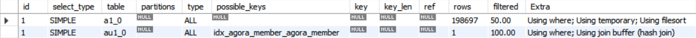

## Explain(실행계획)

### Mysql Explain
- `EXPLAIN` 명령으로 MySQL에서 **실행 계획**을 확인할 수 있는데 이는 **쿼리 문장에서 사용된 테이블의 갯수만큼 출력**한다.

|                |                                                 |
| -------------- | ----------------------------------------------- |
| **실행 계획**      | **의미**                                          |
| `id`             | **SELECT 쿼리 별 부여**되는 식별자 값                          |
| `select_type`    | 각 단위 SELECT 쿼리가 **어떤 타입의 쿼리인지 표시**되는 칼럼             |
| `table`          | 접근하고 있는 테이블에 대한 표시                              |
| **`partitions`** | 테이블에 **파티셔닝**이 되어 있는 경우 사용되는 필드                     |
| **`type`**       | 각 테이블의 레코드를 어떻게 읽었는지에 대한 접근 방식                  |
| `possible_keys`  | “사용될 법했던 인덱스의 목록”이며 반드시 사용된 것은 아님               |
| **`key`**        | 최종 선택된 실행 계획에서 사용되는 인덱스                         |
| `key_len`        | 선택된 인덱스의 길이를 의미                                 |
| `ref`            | 접근 방법이 ref면 참조 조건(equal 비교 조건)으로 어떤 값이 제공됐는지 표시 |
| **`rows`**       | 실행 계획의 효율성 판단을 위해 **예측했던 레코드 건수**를 보여준다. (정확하지는 않음) |
| **`filtered`**   | 필터링되고 남은 레코드의 비율 (정확하지는 않음)                     |
| **`Extra`**      | 옵티마이저가 어떻게 동작하는지에 대해 알려주는 힌트 값                  |

   
> https://zzang9ha.tistory.com/436