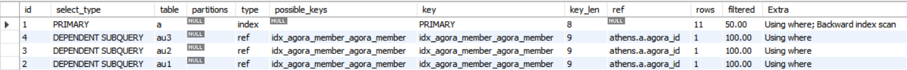
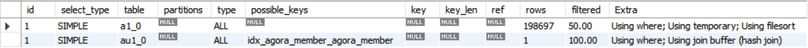

## DB Explain Analyze 분석 (Join VS SubQuery)

```markdown
👋 오늘은 Athens 프로젝트를 진행하다 `qeurydsl`의 쿼리를 Explain Analyze를 통해 분석하다가 흥미로운 사실들을 발견하여 정리하려합니다.

## As-is
- Explain Analyze를 통해 rows를 검색하였을 때 생각보다 많은 `row`를 검색하여 **조회 성능이 많이 낮아진 것을 확인**

## To-be 
- 쿼리를 분석하며 조회 성능을 높일 수 있다면 수정

### 기대 효과
- `Join`과 `SubQeury`의 동작을 이해하고 성능향상을 위한 쿼리 수정이 가능

📌 "버전/조건 관계 없이 좋은 성능을 내려면 최대한 Join을 이용하자" -> 해당 문장에 대한 해답을 알아보자

### Todo 
- [ ]  Job1: Join과 Subquery 를 Explain Analyze 를 통해 분석 및 수정
```

성능 테스트를 위해 20만개의 데이터를 미리 삽입

### SubQuery
```sql
SELECT
    a.agora_id,
    a.title,
    a.color,
    (SELECT COUNT(au1.agora_member_id) 
     FROM agora_member au1 
     WHERE au1.agora_id = a.agora_id 
       AND au1.type = 'PROS') AS pros_count,
    (SELECT COUNT(au2.agora_member_id) 
     FROM agora_member au2 
     WHERE au2.agora_id = a.agora_id 
       AND au2.type = 'CONS') AS cons_count,
    (SELECT COUNT(au3.agora_member_id) 
     FROM agora_member au3 
     WHERE au3.agora_id = a.agora_id 
       AND au3.type = 'OBSERVER') AS observer_count,
    a.created_at,
    a.status
FROM
    agora a
WHERE
    a.status IN ('QUEUED', 'RUNNING')
ORDER BY
    a.agora_id DESC
LIMIT 11;
```

### Join

```sql
SELECT
    a1_0.agora_id,
    a1_0.title,
    a1_0.color,
    SUM(CASE 
        WHEN au1_0.type = 'PROS' 
            THEN 1 
        ELSE 0 
    END) AS pros_count,
    SUM(CASE 
        WHEN au1_0.type = 'CONS' 
            THEN 1 
        ELSE 0 
    END) AS cons_count,
    SUM(CASE 
        WHEN au1_0.type = 'OBSERVER' 
            THEN 1 
        ELSE 0 
    END) AS observer_count,
    a1_0.created_at,
    a1_0.status 
FROM
    agora a1_0 
LEFT JOIN
    agora_member au1_0 
        ON au1_0.agora_id = a1_0.agora_id 
WHERE
    a1_0.status IN ('QUEUED', 'RUNNING')
GROUP BY
    a1_0.agora_id,
    a1_0.title,
    a1_0.color,
    a1_0.created_at,
    a1_0.status 
ORDER BY
    a1_0.agora_id DESC 
LIMIT 11;
```

지금부터 `SubQeury` 와 `Join` 문에 대해 분석해보려 한다. (이에 대한 문제상황은 지속적으로 작성할 것이다.)

### 문제상황 1
- 먼저 `Explain`을 통해 두개의 쿼리를 비교해보자

SubQuery

Join


첫번째는 `Join문`에서 탐색 예상 row수가 `19만개`로 매우 많다는 것을 알 수 있다.
이는 **성능에 영향을 끼치며** 실제로 SubQeury는 `0.xx` 초가 걸리는 반면 JOIN은 `2.xx`초가 걸리는것을 볼 수 있다.

### 문제해결 1
- 문제해결 1은 보기보다 쉽게 알았는데 답은 `Group By`에 있었다.
- Join을 보면 agora id 뿐만 아니라 많은 컬럼에 Group By를 걸어놨는데 id만 그룹화해도 결과는 같다.
- 불필요한 `Group By`는 **성능을 느리게 할 수 있다는 점**을 깨달았다.

수정한 JOIN SQL
```sql
SELECT
    a1_0.agora_id,
    a1_0.title,
    a1_0.color,
    SUM(CASE 
        WHEN au1_0.type = 'PROS' 
            THEN 1 
        ELSE 0 
    END) AS pros_count,
    SUM(CASE 
        WHEN au1_0.type = 'CONS' 
            THEN 1 
        ELSE 0 
    END) AS cons_count,
    SUM(CASE 
        WHEN au1_0.type = 'OBSERVER' 
            THEN 1 
        ELSE 0 
    END) AS observer_count,
    a1_0.created_at,
    a1_0.status 
FROM
    agora a1_0 
LEFT JOIN
    agora_member au1_0 
        ON au1_0.agora_id = a1_0.agora_id 
WHERE
    a1_0.status IN ('QUEUED', 'RUNNING')
GROUP BY
    a1_0.agora_id
ORDER BY
    a1_0.agora_id DESC 
LIMIT 11;
```

### Reference
> https://zzang9ha.tistory.com/436